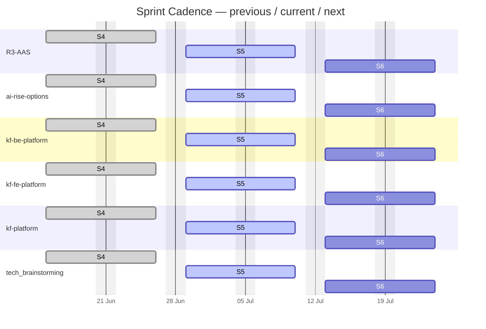
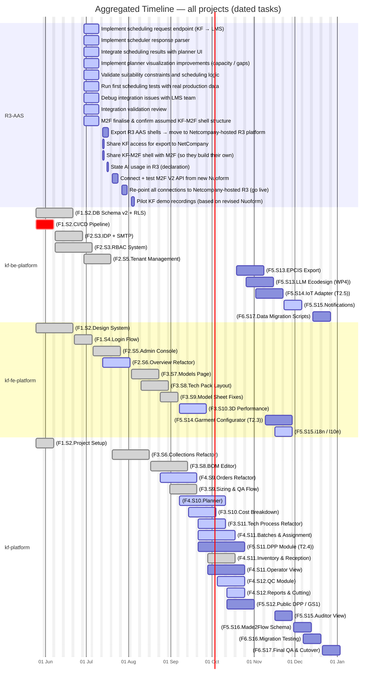
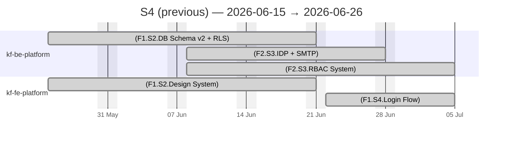
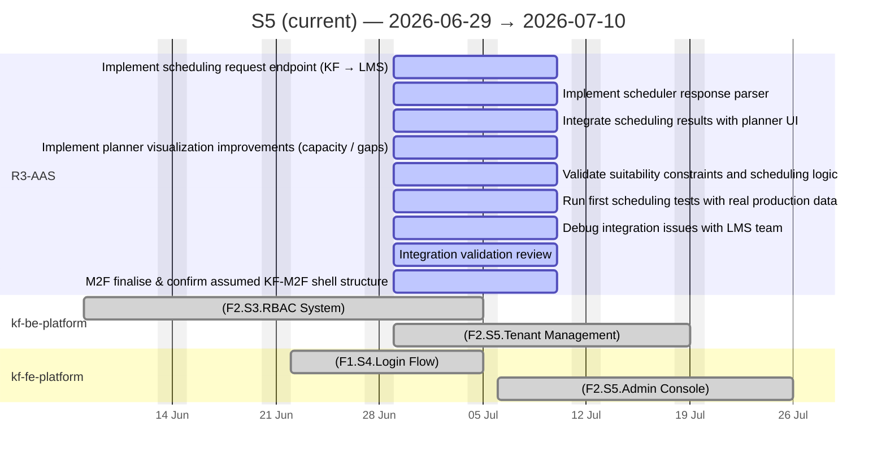
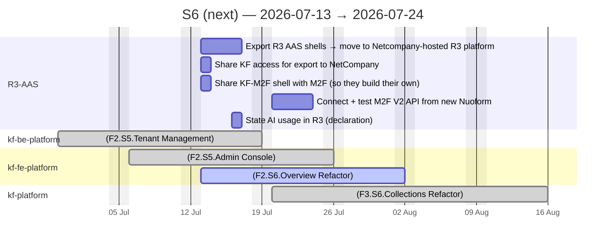

# KF Team — Unified Kanban

> Auto-generated from all project kanbans

  

    
Todo 34

    <a class="kanban-card" href="{{ '/projects/r3-aas/' | relative_url }}">R3-AAS: Backend alignment (după modificări Răzvan)</a>
    <a class="kanban-card" href="{{ '/projects/r3-aas/' | relative_url }}">R3-AAS: Bug-uri identificate în sistem</a>
    <a class="kanban-card" href="{{ '/projects/r3-aas/' | relative_url }}">R3-AAS: Instalare senzor 3 (poziție cutie/flux materiale) — T3.3</a>
    <a class="kanban-card" href="{{ '/projects/r3-aas/' | relative_url }}">R3-AAS: Naming convention pentru task-uri (namespace per proiect)</a>
    <a class="kanban-card" href="{{ '/projects/r3-aas/' | relative_url }}">R3-AAS: Evitarea dublării task-urilor între tools</a>
    <a class="kanban-card" href="{{ '/projects/r3-aas/' | relative_url }}">R3-AAS: Feature flags</a>
    <a class="kanban-card" href="{{ '/projects/r3-aas/' | relative_url }}">R3-AAS: Telemetrie (monitorizare)</a>
    <a class="kanban-card" href="{{ '/projects/r3-aas/' | relative_url }}">R3-AAS: Code quality / stability înainte de release</a>
    <a class="kanban-card" href="{{ '/projects/r3-aas/' | relative_url }}">R3-AAS: Suport tehnic post-launch</a>
    <a class="kanban-card" href="{{ '/projects/r3-aas/' | relative_url }}">R3-AAS: Conectivitate sisteme externe</a>
    <a class="kanban-card" href="{{ '/projects/r3-aas/' | relative_url }}">R3-AAS: Sprint plan (tranziție către GTM)</a>
    <a class="kanban-card" href="{{ '/projects/r3-aas/' | relative_url }}">R3-AAS: Rapoarte săptămânale (nu daily)</a>
    <a class="kanban-card" href="{{ '/projects/r3-aas/' | relative_url }}">R3-AAS: Landing page (claritate produs)</a>
    <a class="kanban-card" href="{{ '/projects/r3-aas/' | relative_url }}">R3-AAS: Definire tehnică monetizare (SaaS readiness)</a>
    <a class="kanban-card" href="{{ '/projects/r3-aas/' | relative_url }}">R3-AAS: Input pentru CRM / pipeline (structură tehnică)</a>
    <a class="kanban-card" href="{{ '/projects/r3-aas/' | relative_url }}">R3-AAS: Export R3 AAS shells → move to Netcompany-hosted R3 platform</a>
    <a class="kanban-card" href="{{ '/projects/r3-aas/' | relative_url }}">R3-AAS: Share KF access for export to NetCompany</a>
    <a class="kanban-card" href="{{ '/projects/r3-aas/' | relative_url }}">R3-AAS: Share KF-M2F shell with M2F (so they build their own)</a>
    <a class="kanban-card" href="{{ '/projects/r3-aas/' | relative_url }}">R3-AAS: Connect + test M2F V2 API from new Nuoform</a>
    <a class="kanban-card" href="{{ '/projects/r3-aas/' | relative_url }}">R3-AAS: Re-point all connections to Netcompany-hosted R3 (go live)</a>
    <a class="kanban-card" href="{{ '/projects/r3-aas/' | relative_url }}">R3-AAS: Pilot KF demo recordings (based on revised Nuoform)</a>
    <a class="kanban-card" href="{{ '/projects/r3-aas/' | relative_url }}">R3-AAS: State AI usage in R3 (declaration)</a>
    <a class="kanban-card" href="{{ '/projects/kf-be-platform/' | relative_url }}">kf-be-platform: [F5.S13.EPCIS Export]</a>
    <a class="kanban-card" href="{{ '/projects/kf-be-platform/' | relative_url }}">kf-be-platform: [F5.S13.LLM Ecodesign (WP4)]</a>
    <a class="kanban-card" href="{{ '/projects/kf-be-platform/' | relative_url }}">kf-be-platform: [F5.S14.IoT Adapter (T2.5)]</a>
    <a class="kanban-card" href="{{ '/projects/kf-be-platform/' | relative_url }}">kf-be-platform: [F6.S17.Data Migration Scripts]</a>
    <a class="kanban-card" href="{{ '/projects/kf-fe-platform/' | relative_url }}">kf-fe-platform: [F5.S14.Garment Configurator (T2.3)]</a>
    <a class="kanban-card" href="{{ '/projects/kf-platform/' | relative_url }}">kf-platform: [F4.S11.Operator View]</a>
    <a class="kanban-card" href="{{ '/projects/kf-platform/' | relative_url }}">kf-platform: [F5.S11.DPP Module (T2.4)]</a>
    <a class="kanban-card" href="{{ '/projects/kf-platform/' | relative_url }}">kf-platform: [F5.S12.Public DPP / GS1]</a>
    <a class="kanban-card" href="{{ '/projects/kf-platform/' | relative_url }}">kf-platform: [F5.S15.Auditor View]</a>
    <a class="kanban-card" href="{{ '/projects/kf-platform/' | relative_url }}">kf-platform: [F5.S16.Made2Flow Schema]</a>
    <a class="kanban-card" href="{{ '/projects/kf-platform/' | relative_url }}">kf-platform: [F6.S16.Migration Testing]</a>
    <a class="kanban-card" href="{{ '/projects/kf-platform/' | relative_url }}">kf-platform: [F6.S17.Final QA &amp; Cutover]</a>
  

  

    
In Progress 17

    <a class="kanban-card" href="{{ '/projects/r3-aas/' | relative_url }}">R3-AAS: T2.3 — Supply Chain Digital Twin: risk modelling</a>
    <a class="kanban-card" href="{{ '/projects/r3-aas/' | relative_url }}">R3-AAS: Acces corect la organizații (login flow issues)</a>
    <a class="kanban-card" href="{{ '/projects/r3-aas/' | relative_url }}">R3-AAS: Testare demo produse (clienți + testeri interni)</a>
    <a class="kanban-card" href="{{ '/projects/r3-aas/' | relative_url }}">R3-AAS: Demo / prezentare produs</a>
    <a class="kanban-card" href="{{ '/projects/r3-aas/' | relative_url }}">R3-AAS: M2F: finalise &amp; confirm assumed KF-M2F shell structure</a>
    <a class="kanban-card" href="{{ '/projects/kf-be-platform/' | relative_url }}">kf-be-platform: [F1.S2.CI/CD Pipeline]</a>
    <a class="kanban-card" href="{{ '/projects/kf-be-platform/' | relative_url }}">kf-be-platform: [F5.S15.Notifications]</a>
    <a class="kanban-card" href="{{ '/projects/kf-fe-platform/' | relative_url }}">kf-fe-platform: [F2.S6.Overview Refactor]</a>
    <a class="kanban-card" href="{{ '/projects/kf-fe-platform/' | relative_url }}">kf-fe-platform: [F3.S10.3D Performance]</a>
    <a class="kanban-card" href="{{ '/projects/kf-fe-platform/' | relative_url }}">kf-fe-platform: [F5.S15.i18n / l10n]</a>
    <a class="kanban-card" href="{{ '/projects/kf-platform/' | relative_url }}">kf-platform: [F3.S10.Cost Breakdown]</a>
    <a class="kanban-card" href="{{ '/projects/kf-platform/' | relative_url }}">kf-platform: [F3.S11.Tech Process Refactor]</a>
    <a class="kanban-card" href="{{ '/projects/kf-platform/' | relative_url }}">kf-platform: [F4.S9.Orders Refactor]</a>
    <a class="kanban-card" href="{{ '/projects/kf-platform/' | relative_url }}">kf-platform: [F4.S10.Planner]</a>
    <a class="kanban-card" href="{{ '/projects/kf-platform/' | relative_url }}">kf-platform: [F4.S11.Batches &amp; Assignment]</a>
    <a class="kanban-card" href="{{ '/projects/kf-platform/' | relative_url }}">kf-platform: [F4.S12.QC Module]</a>
    <a class="kanban-card" href="{{ '/projects/kf-platform/' | relative_url }}">kf-platform: [F4.S12.Reports &amp; Cutting]</a>
  

  

    
Review 15

    <a class="kanban-card" href="{{ '/projects/r3-aas/' | relative_url }}">R3-AAS: WP1 — AAS platform integration (digital infrastructure)</a>
    <a class="kanban-card" href="{{ '/projects/r3-aas/' | relative_url }}">R3-AAS: T2.4 — Capacity Planner: KF Planner UI</a>
    <a class="kanban-card" href="{{ '/projects/r3-aas/' | relative_url }}">R3-AAS: T2.4 — Capacity Planner: KF ↔ LMS Integration</a>
    <a class="kanban-card" href="{{ '/projects/r3-aas/' | relative_url }}">R3-AAS: T3.3 — IoT Monitoring: sensors deployment</a>
    <a class="kanban-card" href="{{ '/projects/r3-aas/' | relative_url }}">R3-AAS: Integrare între sisteme (Katty / LMS)</a>
    <a class="kanban-card" href="{{ '/projects/r3-aas/' | relative_url }}">R3-AAS: Integrare LMS (AAS extern)</a>
    <a class="kanban-card" href="{{ '/projects/r3-aas/' | relative_url }}">R3-AAS: UI flow (parțial complet)</a>
    <a class="kanban-card" href="{{ '/projects/r3-aas/' | relative_url }}">R3-AAS: Implement scheduling request endpoint (KF → LMS)</a>
    <a class="kanban-card" href="{{ '/projects/r3-aas/' | relative_url }}">R3-AAS: Implement scheduler response parser</a>
    <a class="kanban-card" href="{{ '/projects/r3-aas/' | relative_url }}">R3-AAS: Integrate scheduling results with planner UI</a>
    <a class="kanban-card" href="{{ '/projects/r3-aas/' | relative_url }}">R3-AAS: Implement planner visualization improvements (capacity / gaps)</a>
    <a class="kanban-card" href="{{ '/projects/r3-aas/' | relative_url }}">R3-AAS: Validate suitability constraints and scheduling logic</a>
    <a class="kanban-card" href="{{ '/projects/r3-aas/' | relative_url }}">R3-AAS: Run first scheduling tests with real production data</a>
    <a class="kanban-card" href="{{ '/projects/r3-aas/' | relative_url }}">R3-AAS: Debug integration issues with LMS team</a>
    <a class="kanban-card" href="{{ '/projects/r3-aas/' | relative_url }}">R3-AAS: Integration validation review</a>
  

  

    
Done 46

    <a class="kanban-card" href="{{ '/projects/r3-aas/' | relative_url }}">R3-AAS: T2.1 — Co-creation platform (Nuoform)</a>
    <a class="kanban-card" href="{{ '/projects/r3-aas/' | relative_url }}">R3-AAS: T3.2 — Product Digital Twin (AAS model)</a>
    <a class="kanban-card" href="{{ '/projects/r3-aas/' | relative_url }}">R3-AAS: T3.2 — Process Digital Twin (Tecnomatix simulation)</a>
    <a class="kanban-card" href="{{ '/projects/r3-aas/' | relative_url }}">R3-AAS: T2.4 — Capacity Planner: LMS Scheduler Backend</a>
    <a class="kanban-card" href="{{ '/projects/r3-aas/' | relative_url }}">R3-AAS: AAS import/export tooling (aas_export.py, import-demo.sh)</a>
    <a class="kanban-card" href="{{ '/projects/r3-aas/' | relative_url }}">R3-AAS: Order_3_Aas shell (8 submodels, cost + schedule)</a>
    <a class="kanban-card" href="{{ '/projects/r3-aas/' | relative_url }}">R3-AAS: Demo UI R3Group (Next 16: Design → Simulation → Shopfloor → Impact; LMS re-optimise)</a>
    <a class="kanban-card" href="{{ '/projects/r3-aas/' | relative_url }}">R3-AAS: OAuth2 auth-server public + per-client provisioning</a>
    <a class="kanban-card" href="{{ '/projects/r3-aas/' | relative_url }}">R3-AAS: ALADIN WP2 RunSheet service (nginx + Traefik routing)</a>
    <a class="kanban-card" href="{{ '/projects/r3-aas/' | relative_url }}">R3-AAS: Clarificare acces server R3 (Vangelis)</a>
    <a class="kanban-card" href="{{ '/projects/r3-aas/' | relative_url }}">R3-AAS: Clarificare format date platforma R3</a>
    <a class="kanban-card" href="{{ '/projects/r3-aas/' | relative_url }}">R3-AAS: Arhitectură multi-tenant (in place)</a>
    <a class="kanban-card" href="{{ '/projects/r3-aas/' | relative_url }}">R3-AAS: Separare date per client (in place)</a>
    <a class="kanban-card" href="{{ '/projects/r3-aas/' | relative_url }}">R3-AAS: Flow sistem (UI → AAS → backend)</a>
    <a class="kanban-card" href="{{ '/projects/r3-aas/' | relative_url }}">R3-AAS: Multiple tipuri AAS → standardizare</a>
    <a class="kanban-card" href="{{ '/projects/r3-aas/' | relative_url }}">R3-AAS: Layout simplificat pilot (stații + flux + senzori)</a>
    <a class="kanban-card" href="{{ '/projects/r3-aas/' | relative_url }}">R3-AAS: Sketch → JSON → sistem</a>
    <a class="kanban-card" href="{{ '/projects/r3-aas/' | relative_url }}">R3-AAS: LMS specs + credentials</a>
    <a class="kanban-card" href="{{ '/projects/r3-aas/' | relative_url }}">R3-AAS: Vizualizare date / UI</a>
    <a class="kanban-card" href="{{ '/projects/r3-aas/' | relative_url }}">R3-AAS: Deploy AAS în Cloud (hosting)</a>
    <a class="kanban-card" href="{{ '/projects/r3-aas/' | relative_url }}">R3-AAS: Clarificare format date pentru platforma R3</a>
    <a class="kanban-card" href="{{ '/projects/r3-aas/' | relative_url }}">R3-AAS: Board central Kanban – single source of truth</a>
    <a class="kanban-card" href="{{ '/projects/r3-aas/' | relative_url }}">R3-AAS: Task-uri ↔ Work Packages (WP mapping)</a>
    <a class="kanban-card" href="{{ '/projects/r3-aas/' | relative_url }}">R3-AAS: Reprezentare Gantt (timeline / corelare temporală)</a>
    <a class="kanban-card" href="{{ '/projects/r3-aas/' | relative_url }}">R3-AAS: GitHub Actions pentru sync task-uri</a>
    <a class="kanban-card" href="{{ '/projects/r3-aas/' | relative_url }}">R3-AAS: Generare automată status / reports</a>
    <a class="kanban-card" href="{{ '/projects/r3-aas/' | relative_url }}">R3-AAS: Pipeline CI/CD (necesar pentru GTM)</a>
    <a class="kanban-card" href="{{ '/projects/r3-aas/' | relative_url }}">R3-AAS: Acces VPN + onboarding corect</a>
    <a class="kanban-card" href="{{ '/projects/r3-aas/' | relative_url }}">R3-AAS: Corelare Sprint tasks ↔ Work Packages</a>
    <a class="kanban-card" href="{{ '/projects/r3-aas/' | relative_url }}">R3-AAS: Task-uri cu timeline (start/end)</a>
    <a class="kanban-card" href="{{ '/projects/r3-aas/' | relative_url }}">R3-AAS: Gantt / timeline pentru progres</a>
    <a class="kanban-card" href="{{ '/projects/kf-be-platform/' | relative_url }}">kf-be-platform: [F1.S2.DB Schema v2 + RLS]</a>
    <a class="kanban-card" href="{{ '/projects/kf-be-platform/' | relative_url }}">kf-be-platform: [F2.S3.IDP + SMTP]</a>
    <a class="kanban-card" href="{{ '/projects/kf-be-platform/' | relative_url }}">kf-be-platform: [F2.S3.RBAC System]</a>
    <a class="kanban-card" href="{{ '/projects/kf-be-platform/' | relative_url }}">kf-be-platform: [F2.S5.Tenant Management]</a>
    <a class="kanban-card" href="{{ '/projects/kf-fe-platform/' | relative_url }}">kf-fe-platform: [F1.S2.Design System]</a>
    <a class="kanban-card" href="{{ '/projects/kf-fe-platform/' | relative_url }}">kf-fe-platform: [F1.S4.Login Flow]</a>
    <a class="kanban-card" href="{{ '/projects/kf-fe-platform/' | relative_url }}">kf-fe-platform: [F2.S5.Admin Console]</a>
    <a class="kanban-card" href="{{ '/projects/kf-fe-platform/' | relative_url }}">kf-fe-platform: [F3.S7.Models Page]</a>
    <a class="kanban-card" href="{{ '/projects/kf-fe-platform/' | relative_url }}">kf-fe-platform: [F3.S8.Tech Pack Layout]</a>
    <a class="kanban-card" href="{{ '/projects/kf-fe-platform/' | relative_url }}">kf-fe-platform: [F3.S9.Model Sheet Fixes]</a>
    <a class="kanban-card" href="{{ '/projects/kf-platform/' | relative_url }}">kf-platform: [F1.S2.Project Setup]</a>
    <a class="kanban-card" href="{{ '/projects/kf-platform/' | relative_url }}">kf-platform: [F3.S6.Collections Refactor]</a>
    <a class="kanban-card" href="{{ '/projects/kf-platform/' | relative_url }}">kf-platform: [F3.S8.BOM Editor]</a>
    <a class="kanban-card" href="{{ '/projects/kf-platform/' | relative_url }}">kf-platform: [F3.S9.Sizing &amp; QA Flow]</a>
    <a class="kanban-card" href="{{ '/projects/kf-platform/' | relative_url }}">kf-platform: [F4.S11.Inventory &amp; Reception]</a>
  

## Summary by Project

| Project | Todo | In Progress | Review | Done | Total |
| :--- | :---: | :---: | :---: | :---: | :---: |
| R3-AAS | 22 | 5 | 15 | 31 | 73 |
| ai-rise-options | 0 | 0 | 0 | 0 | 0 |
| kf-be-platform | 4 | 2 | 0 | 4 | 10 |
| kf-fe-platform | 1 | 3 | 0 | 6 | 10 |
| kf-platform | 7 | 7 | 0 | 5 | 19 |
| tech_brainstorming | 0 | 0 | 0 | 0 | 0 |

## Sprint Timeline

> Previous · current · next sprint per project (from each repo's declared sprint)

```mermaid
gantt
    title Sprint Cadence — previous / current / next
    dateFormat YYYY-MM-DD
    axisFormat %d %b
    excludes weekends

    section R3-AAS
    S4 :done, 2026-06-15, 2026-06-26
    S5 :active, 2026-06-29, 2026-07-10
    S6 :2026-07-13, 2026-07-24
    section ai-rise-options
    S4 :done, 2026-06-15, 2026-06-26
    S5 :active, 2026-06-29, 2026-07-10
    S6 :2026-07-13, 2026-07-24
    section kf-be-platform
    S4 :done, 2026-06-15, 2026-06-26
    S5 :active, 2026-06-29, 2026-07-10
    S6 :2026-07-13, 2026-07-24
    section kf-fe-platform
    S4 :done, 2026-06-15, 2026-06-26
    S5 :active, 2026-06-29, 2026-07-10
    S6 :2026-07-13, 2026-07-24
    section kf-platform
    S4 :done, 2026-06-15, 2026-06-26
    S5 :active, 2026-06-29, 2026-07-10
    S6 :2026-07-13, 2026-07-24
    section tech_brainstorming
    S4 :done, 2026-06-15, 2026-06-26
    S5 :active, 2026-06-29, 2026-07-10
    S6 :2026-07-13, 2026-07-24
```

PlannedIn workLate / At riskDone

## Full Timeline — All Projects

> Every dated task across all tracked repos, coloured by status

```mermaid
gantt
    title Aggregated Timeline — all projects (dated tasks)
    dateFormat YYYY-MM-DD
    axisFormat %d %b
    excludes weekends

    section R3-AAS
    Implement scheduling request endpoint (KF → LMS) :active, 2026-06-29, 2026-07-10
    Implement scheduler response parser :active, 2026-06-29, 2026-07-10
    Integrate scheduling results with planner UI :active, 2026-06-29, 2026-07-10
    Implement planner visualization improvements (capacity / gaps) :active, 2026-06-29, 2026-07-10
    Validate suitability constraints and scheduling logic :active, 2026-06-29, 2026-07-10
    Run first scheduling tests with real production data :active, 2026-06-29, 2026-07-10
    Debug integration issues with LMS team :active, 2026-06-29, 2026-07-10
    Integration validation review :active, 2026-06-29, 2026-07-10
    M2F finalise & confirm assumed KF-M2F shell structure :active, 2026-06-29, 2026-07-10
    Export R3 AAS shells → move to Netcompany-hosted R3 platform :2026-07-13, 2026-07-17
    Share KF access for export to NetCompany :2026-07-13, 2026-07-14
    Share KF-M2F shell with M2F (so they build their own) :2026-07-13, 2026-07-14
    State AI usage in R3 (declaration) :2026-07-16, 2026-07-17
    Connect + test M2F V2 API from new Nuoform :2026-07-20, 2026-07-24
    Re-point all connections to Netcompany-hosted R3 (go live) :2026-07-27, 2026-07-31
    Pilot KF demo recordings (based on revised Nuoform) :2026-08-03, 2026-08-05
    section kf-be-platform
    (F1.S2.DB Schema v2 + RLS) :done, 2026-05-25, 2026-06-21
    (F1.S2.CI/CD Pipeline) :crit, 2026-05-25, 2026-06-07
    (F2.S3.IDP + SMTP) :done, 2026-06-08, 2026-06-28
    (F2.S3.RBAC System) :done, 2026-06-08, 2026-07-05
    (F2.S5.Tenant Management) :done, 2026-06-29, 2026-07-19
    (F5.S13.EPCIS Export) :2026-10-19, 2026-11-08
    (F5.S13.LLM Ecodesign (WP4)) :2026-10-26, 2026-11-15
    (F5.S14.IoT Adapter (T2.5)) :2026-11-02, 2026-11-22
    (F5.S15.Notifications) :active, 2026-11-23, 2026-12-06
    (F6.S17.Data Migration Scripts) :2026-12-14, 2026-12-27
    section kf-fe-platform
    (F1.S2.Design System) :done, 2026-05-25, 2026-06-21
    (F1.S4.Login Flow) :done, 2026-06-22, 2026-07-05
    (F2.S5.Admin Console) :done, 2026-07-06, 2026-07-26
    (F2.S6.Overview Refactor) :active, 2026-07-13, 2026-08-02
    (F3.S7.Models Page) :done, 2026-08-03, 2026-08-23
    (F3.S8.Tech Pack Layout) :done, 2026-08-10, 2026-08-30
    (F3.S9.Model Sheet Fixes) :done, 2026-08-24, 2026-09-06
    (F3.S10.3D Performance) :active, 2026-09-07, 2026-09-27
    (F5.S14.Garment Configurator (T2.3)) :2026-11-09, 2026-11-29
    (F5.S15.i18n / l10n) :active, 2026-11-16, 2026-11-29
    section kf-platform
    (F1.S2.Project Setup) :done, 2026-05-25, 2026-06-07
    (F3.S6.Collections Refactor) :done, 2026-07-20, 2026-08-16
    (F3.S8.BOM Editor) :done, 2026-08-17, 2026-09-13
    (F4.S9.Orders Refactor) :active, 2026-08-24, 2026-09-20
    (F3.S9.Sizing & QA Flow) :done, 2026-08-31, 2026-09-20
    (F4.S10.Planner) :active, 2026-09-07, 2026-10-11
    (F3.S10.Cost Breakdown) :active, 2026-09-14, 2026-10-04
    (F3.S11.Tech Process Refactor) :active, 2026-09-21, 2026-10-11
    (F4.S11.Batches & Assignment) :active, 2026-09-21, 2026-10-18
    (F5.S11.DPP Module (T2.4)) :2026-09-21, 2026-10-25
    (F4.S11.Inventory & Reception) :done, 2026-09-28, 2026-10-18
    (F4.S11.Operator View) :2026-09-28, 2026-10-25
    (F4.S12.QC Module) :active, 2026-10-05, 2026-10-25
    (F4.S12.Reports & Cutting) :active, 2026-10-12, 2026-10-25
    (F5.S12.Public DPP / GS1) :2026-10-12, 2026-11-01
    (F5.S15.Auditor View) :2026-11-16, 2026-11-29
    (F5.S16.Made2Flow Schema) :2026-11-30, 2026-12-13
    (F6.S16.Migration Testing) :2026-12-07, 2026-12-20
    (F6.S17.Final QA & Cutover) :2026-12-21, 2027-01-03
```

PlannedIn workLate / At riskDone

## Sprint Views — previous / current / next

### Sprint S4 (previous) — 2026-06-15 → 2026-06-26

```mermaid
gantt
    title S4 (previous) — 2026-06-15 → 2026-06-26
    dateFormat YYYY-MM-DD
    axisFormat %d %b
    excludes weekends

    section kf-be-platform
    (F1.S2.DB Schema v2 + RLS) :done, 2026-05-25, 2026-06-21
    (F2.S3.IDP + SMTP) :done, 2026-06-08, 2026-06-28
    (F2.S3.RBAC System) :done, 2026-06-08, 2026-07-05
    section kf-fe-platform
    (F1.S2.Design System) :done, 2026-05-25, 2026-06-21
    (F1.S4.Login Flow) :done, 2026-06-22, 2026-07-05
```

PlannedIn workLate / At riskDone

### Sprint S5 (current) — 2026-06-29 → 2026-07-10

```mermaid
gantt
    title S5 (current) — 2026-06-29 → 2026-07-10
    dateFormat YYYY-MM-DD
    axisFormat %d %b
    excludes weekends

    section R3-AAS
    Implement scheduling request endpoint (KF → LMS) :active, 2026-06-29, 2026-07-10
    Implement scheduler response parser :active, 2026-06-29, 2026-07-10
    Integrate scheduling results with planner UI :active, 2026-06-29, 2026-07-10
    Implement planner visualization improvements (capacity / gaps) :active, 2026-06-29, 2026-07-10
    Validate suitability constraints and scheduling logic :active, 2026-06-29, 2026-07-10
    Run first scheduling tests with real production data :active, 2026-06-29, 2026-07-10
    Debug integration issues with LMS team :active, 2026-06-29, 2026-07-10
    Integration validation review :active, 2026-06-29, 2026-07-10
    M2F finalise & confirm assumed KF-M2F shell structure :active, 2026-06-29, 2026-07-10
    section kf-be-platform
    (F2.S3.RBAC System) :done, 2026-06-08, 2026-07-05
    (F2.S5.Tenant Management) :done, 2026-06-29, 2026-07-19
    section kf-fe-platform
    (F1.S4.Login Flow) :done, 2026-06-22, 2026-07-05
    (F2.S5.Admin Console) :done, 2026-07-06, 2026-07-26
```

PlannedIn workLate / At riskDone

### Sprint S6 (next) — 2026-07-13 → 2026-07-24

```mermaid
gantt
    title S6 (next) — 2026-07-13 → 2026-07-24
    dateFormat YYYY-MM-DD
    axisFormat %d %b
    excludes weekends

    section R3-AAS
    Export R3 AAS shells → move to Netcompany-hosted R3 platform :2026-07-13, 2026-07-17
    Share KF access for export to NetCompany :2026-07-13, 2026-07-14
    Share KF-M2F shell with M2F (so they build their own) :2026-07-13, 2026-07-14
    Connect + test M2F V2 API from new Nuoform :2026-07-20, 2026-07-24
    State AI usage in R3 (declaration) :2026-07-16, 2026-07-17
    section kf-be-platform
    (F2.S5.Tenant Management) :done, 2026-06-29, 2026-07-19
    section kf-fe-platform
    (F2.S5.Admin Console) :done, 2026-07-06, 2026-07-26
    (F2.S6.Overview Refactor) :active, 2026-07-13, 2026-08-02
    section kf-platform
    (F3.S6.Collections Refactor) :done, 2026-07-20, 2026-08-16
```

PlannedIn workLate / At riskDone

